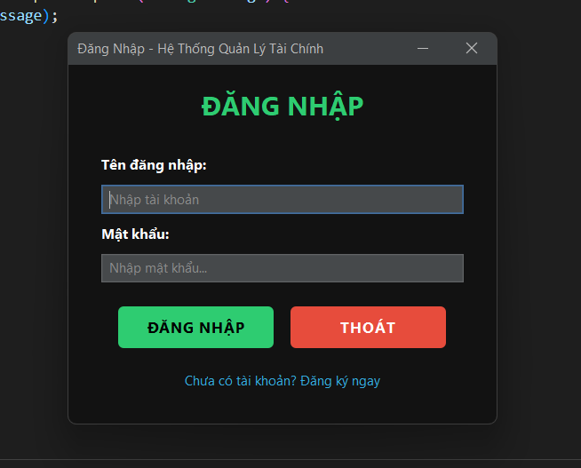
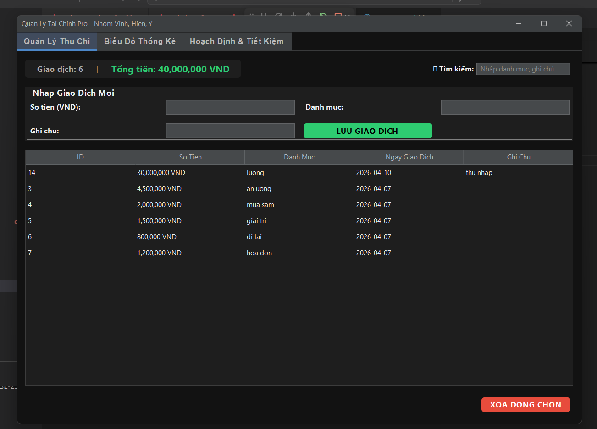
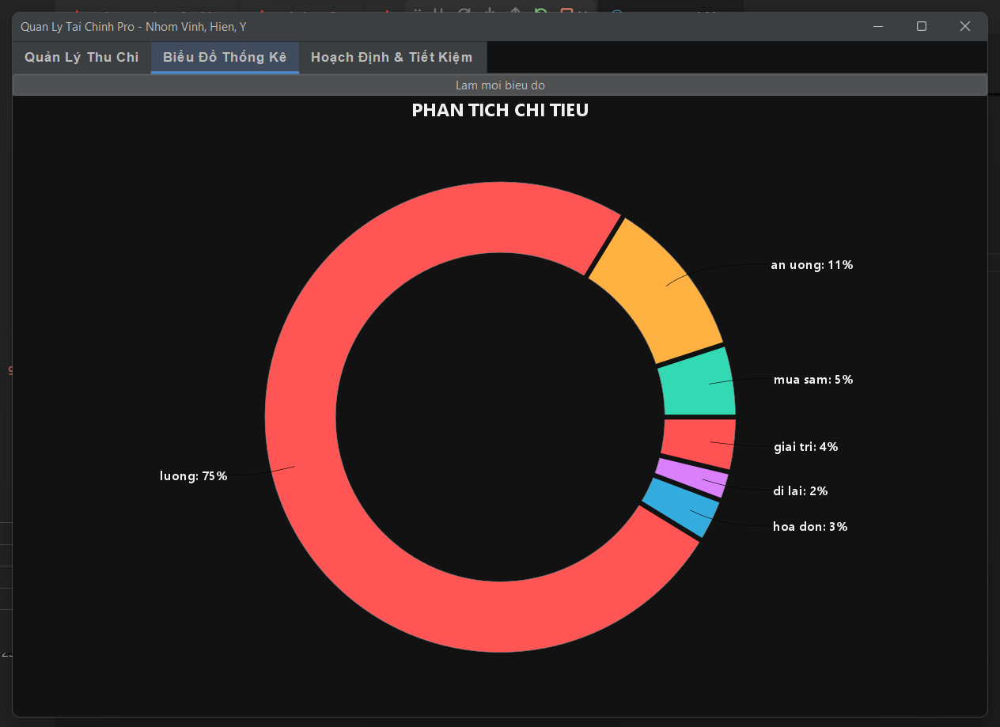
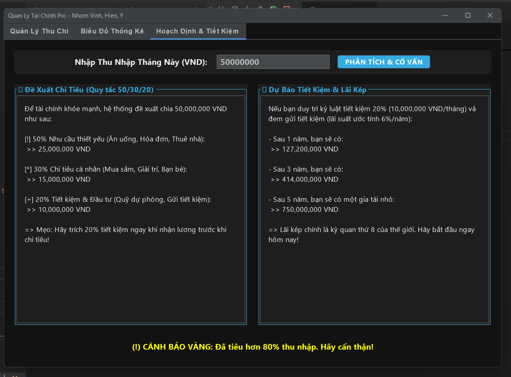

# 🎓 Phần Mềm Quản Lý Tài Chính Cá Nhân Pro
> **Bài tập lớn cuối kỳ môn Lập trình Java**
> **🔗 [Link Video Demo YouTube]:** (Dán link video của nhóm vào đây)

## 👥 Thông tin nhóm (Team Members)
| STT | Tên | Vai trò / Nhiệm vụ | Link GitHub Cá Nhân |
|---|---|---|---|
| 1 | [Vinh] | Code Controller, Database, Xử lý Logic | [GitHub](link_cua_Vinh) |
| 2 | [THiền] | Code UI/UX, Tích hợp FlatLaf Dark Theme | [GitHub](link_cua_Hien) |
| 3 |  [Ý] | Biểu đồ JFreeChart, Animation, Báo cáo | [GitHub](link_cua_Y) |

## 📝 Giới thiệu dự án (Description)
Đây là phần mềm Quản lý Tài chính cá nhân thông minh giúp sinh viên và người đi làm dễ dàng ghi chép thu chi, quản lý ngân sách. Ứng dụng nổi bật với giao diện Dark Theme hiện đại, khả năng phân tích dữ liệu trực quan bằng biểu đồ động và tích hợp "Cố vấn tài chính AI" tự động cảnh báo chi tiêu.

## ✨ Các chức năng chính (Features)
- [x] Quản lý thông tin (Thêm, Xóa, Liệt kê dữ liệu) tích hợp thanh tìm kiếm thông minh **Live Search**.
- [x] Lưu trữ dữ liệu vĩnh viễn với Cơ sở dữ liệu MySQL an toàn.
- [x] Giao diện người dùng (GUI) thân thiện, thiết kế **Dark Theme** hiện đại bằng thư viện FlatLaf cùng hiệu ứng Hover.
- [x] Bắt lỗi nhập liệu chặt chẽ (Exception Handling) với Custom Exception.
- [x] **[Tính năng nổi bật 1]: Trực quan hóa dữ liệu chi tiêu bằng Biểu đồ Donut (JFreeChart) tùy biến màu Pastel và tích hợp hoạt ảnh (Animation) xoay 360 độ.**
- [x] **[Tính năng nổi bật 2]: Hệ thống Cố vấn Tài chính Thông minh: Tự động phân bổ ngân sách (Quy tắc 50/30/20), cảnh báo rủi ro chi tiêu âm tiền và dự báo lãi kép.**
- [x] **[Tính năng nổi bật 3]: Hệ thống Đăng nhập (Login) phân quyền nhận diện nhiều người dùng (Vinh, Hiền, Ý).**

## 💻 Công nghệ & Thư viện sử dụng (Technologies)
* **Ngôn ngữ:** Java (JDK 17+)
* **Giao diện:** Java Swing, FlatLaf (Dark Theme)
* **Cơ sở dữ liệu / Lưu trữ:** MySQL (JDBC)
* **Thư viện khác:** JFreeChart (Vẽ biểu đồ)
* **Công cụ khác:** Git, GitHub, VS Code

## 📂 Cấu trúc thư mục (Project Structure)
Mã nguồn được tổ chức chặt chẽ theo mô hình **MVC (Model - View - Controller)**:

📦 src
┣ 📂 model       # Chứa các lớp đối tượng thực thể (Transaction...)
┣ 📂 view        # Chứa giao diện (MainFrame, LoginFrame, RegisterFrame)
┣ 📂 controller  # Chứa logic nghiệp vụ, kết nối DB (TransactionController)
┣ 📂 utils       # Chứa các lớp tiện ích (DBConnection, InvalidInputException)
┗ 📜 Main.java   # File Entry-point để khởi động ứng dụng

## 🚀 Hướng dẫn cài đặt và chạy (Installation)
1. **Khởi tạo Database:**
* Mở XAMPP, bật Apache và MySQL.
* Truy cập phpMyAdmin và import file `database.sql` nằm trong thư mục gốc.
2. **Cấu hình Thư viện:**
* Mở project bằng IDE. Add toàn bộ file `.jar` trong thư mục `lib` vào Referenced Libraries.
3. **Chạy ứng dụng:**
* Chạy file `Main.java` (Nằm ở thư mục gốc) để bắt đầu.

## 📸 Ảnh chụp màn hình (Screenshots)
   